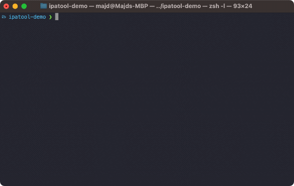

<p align="center">
  <a href="https://GitHub.com/majd/ipatool/releases/"></a>
  <a href="https://github.com/majd/ipatool/blob/main/LICENSE"></a>
  <a href="https://github.com/sponsors/majd"></a>
</p>

<p align="center">
  <code>ipatool</code> is a command line tool that allows you to search for iOS, iPadOS, tvOS, visionOS, and macOS apps on the <a href="https://apps.apple.com">App Store</a>, and download <code>.ipa</code> or macOS <code>.pkg</code> app packages.
</p>

<p align="center">
  
</p>

## Requirements

- A supported operating system (macOS, Linux, Windows or iOS).
- An Apple Account already configured to use the App Store.

## Installation

### Linux and Windows

You can grab the latest version of `ipatool` from [GitHub releases](https://github.com/majd/ipatool/releases).

### macOS

You can install `ipatool` using [Homebrew](https://brew.sh).

```shell
$ brew install ipatool
```

## Usage

To get started, run the following command.

```text
$ ipatool --help
A cli tool for interacting with Apple's ipa files

Usage:
  ipatool [command]

Available Commands:
  auth                 Authenticate with the App Store
  completion           Generate the autocompletion script for the specified shell
  download             Download iOS, iPadOS, tvOS, visionOS, and macOS app packages from the App Store
  get-version-metadata Retrieves the metadata for a specific version of an app
  help                 Help about any command
  list-purchases       List apps owned by the authenticated App Store account
  list-versions        List the available versions of an App Store app
  purchase             Obtain a license for the app from the App Store
  search               Search for iOS, iPadOS, tvOS, visionOS, and macOS apps available on the App Store

Flags:
      --format format                sets output format for command; can be 'text', 'json' (default text)
  -h, --help                         help for ipatool
      --keychain-passphrase string   passphrase for unlocking keychain
      --non-interactive              run in non-interactive session
      --verbose                      enables verbose logs
  -v, --version                      version for ipatool

Use "ipatool [command] --help" for more information about a command.
```

**Note:** the tool runs in interactive mode by default. Use the `--non-interactive` flag
if running in an automated environment.

## Compiling

The tool can be compiled using the Go toolchain.

```shell
$ go build -o ipatool
```

Unit tests can be executed with the following commands.

```shell
$ go generate ./...
$ go test -v ./...
```

## License

ipatool is released under the [MIT license](https://github.com/majd/ipatool/blob/main/LICENSE).
